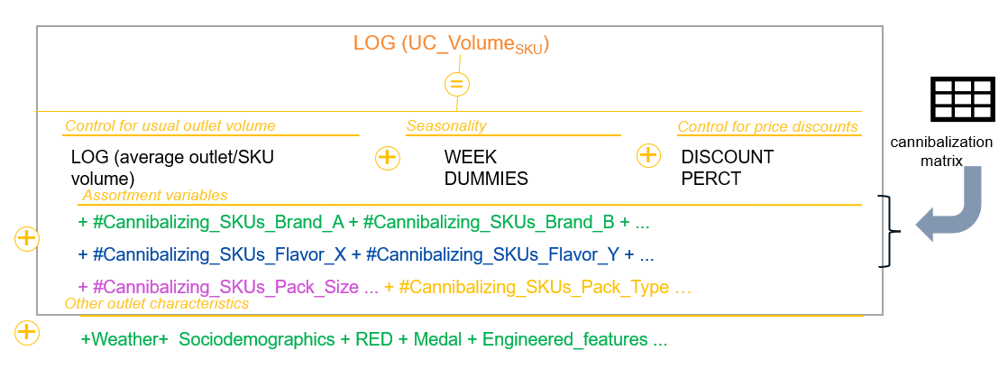

# Demand-Forecasting

Nous modélisons la performance des SKUs (capturée par les ventes
observées représentées) à partir d’un modèle de demande à effet fixe (contrôle du 
volume de sortie habituel). 

Un input important au modèle est une matrice signalant la 
cannibalisation entre les marques et les saveurs? et les données rélatives aux temperatures, au calendrier(sémaines, vacances, jours fériés, fêtes). 

Pour simplifier la compréhension, cidessous le modèle par SKU pour un cluster donné s’écrira comme suit :

<!-- -->

Avant l’étape de l’implémentation de la régression pénalisée, nous avons créé des fonctions afin 
de nous aider à réaliser automatiquement certaines analyses exploratoires.Ainsi, des 
fonctions était chargées de :

- Eliminer les variables dont la variance est égale ou inférieure au seuil 0 .001
- Supprimer les variables fortement corrélées s’il ne vienne pas de la matrice de 
cannibalisation. Seuil fixé à 0 .8
- Supprimer les variables avec des VIF supérieur à 10.
